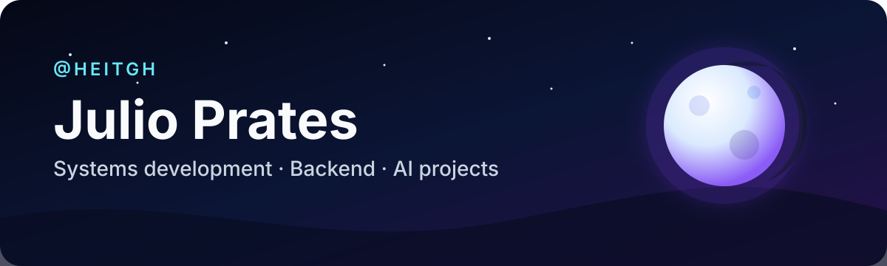

  

### Systems Development Student · Software Developer · Backend & AI Projects

Construindo software claro e útil para a forma como as pessoas trabalham — de APIs e automações a experiências desktop.

## Sobre mim

Sou Julio Prates, estudante do curso **Técnico em Desenvolvimento de Sistemas no SENAI**. Construo projetos que combinam software, automação e inteligência artificial, com foco atual em back-end, sistemas desktop, infraestrutura Linux e experiências centradas no usuário.

Valorizo software compreensível, acessível e estruturado com propósito. Meu principal projeto é o **Moon Browser**, no qual exploro como um navegador pode respeitar melhor a forma como as pessoas pensam, trabalham e navegam.

## Foco atual

- Construção e validação das próximas etapas do **Moon Browser**.
- Aprofundamento prático em **Java** e **Python**.
- Desenvolvimento de APIs, automações e sistemas que utilizam IA com responsabilidade.
- Estudos de arquitetura de software, segurança, testes e Linux.
- Formação técnica em Desenvolvimento de Sistemas no **SENAI**.

## Moon Browser · COMING SOON

  

### What if the browser adapted to the user, instead of forcing the user to adapt to the browser?

O Moon é um navegador desktop de código aberto construído sobre **Electron e Chromium**. O projeto explora uma forma mais ergonômica, contextual e pessoal de navegar, mantendo o controle com o usuário e avançando com cuidado em direção a recursos nativos de IA.

- **Ergonomia digital** — menos atrito visual e mais conforto durante sessões prolongadas.
- **Personalização profunda** — uma interface moldada pelas preferências de cada pessoa.
- **Produtividade contextual** — abas, espaços de trabalho e ferramentas organizados em torno da intenção.
- **Privacidade e controle** — decisões explícitas, base local e supervisão humana.
- **Evolução responsável da IA** — recursos inteligentes somente quando forem reais, úteis e conscientes das permissões concedidas.

**Construído com**

> [!IMPORTANT]
> **O Moon Browser está em desenvolvimento ativo.** Uma demo pública inicial está disponível para experimentação, enquanto a experiência estável permanece **COMING SOON**.

O <a href="https://github.com/heitgh/Moon-tests-1">laboratório público de reconstrução do Moon</a> permanece disponível como histórico técnico e ambiente de experimentação; o projeto oficial está em <a href="https://github.com/heitgh/Moon-browser">Moon-browser</a>.

## Tecnologias

### Linguagens principais

**Uso atual:** Python, Java · **Utilizadas no Moon:** TypeScript, JavaScript

### Back-end e dados

**Experiência prática:** Node.js, APIs REST, SQLite e conceitos de banco de dados aplicados nos projetos

### Desktop e web

**Experiência em projetos:** Electron, Chromium, HTML e CSS

### Qualidade e ferramentas

**Utilizadas no desenvolvimento:** Git, GitHub Actions, Playwright e Vitest

### Ambiente

**Ambiente de uso e estudo:** Linux

## Atividade no GitHub

  

Este painel reflete apenas a atividade pública no GitHub; ele não representa senioridade profissional.

## Formação

**Técnico em Desenvolvimento de Sistemas — SENAI** 
Situação: **Em andamento**

As áreas atuais de estudo incluem desenvolvimento de software, APIs, bancos de dados, testes, segurança e fundamentos de sistemas.

## Contato

Para acompanhar o Moon Browser ou conversar sobre software, back-end, automação e tecnologia centrada no usuário, você pode me encontrar aqui:

---

  <strong>Building software that adapts to people — not the other way around.</strong>

<!-- daily-maintenance: 2026-09-15 -->
<!-- contribution-check: 2026-09-14 | status: not-confirmed -->
